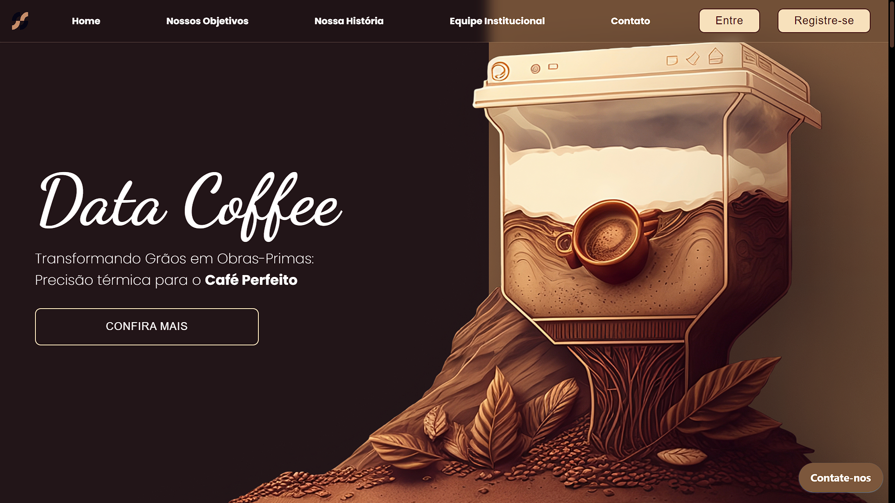
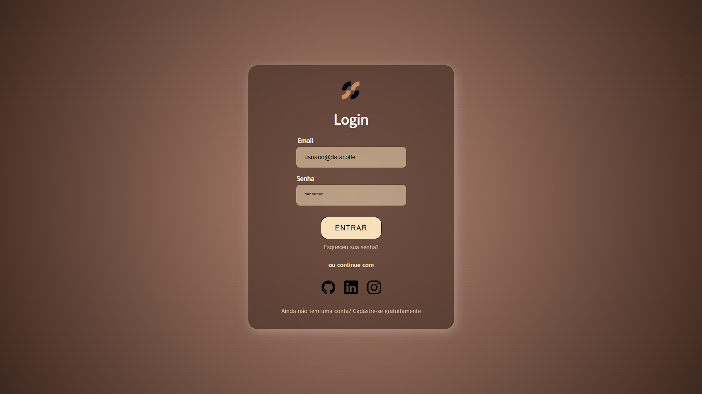
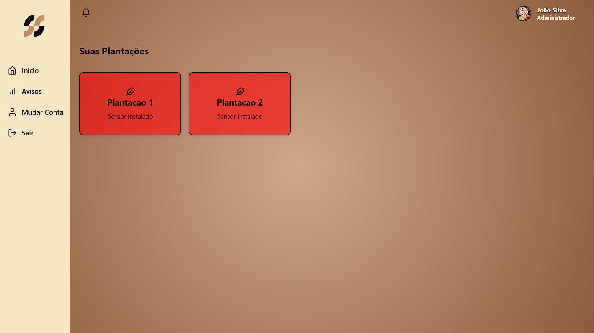
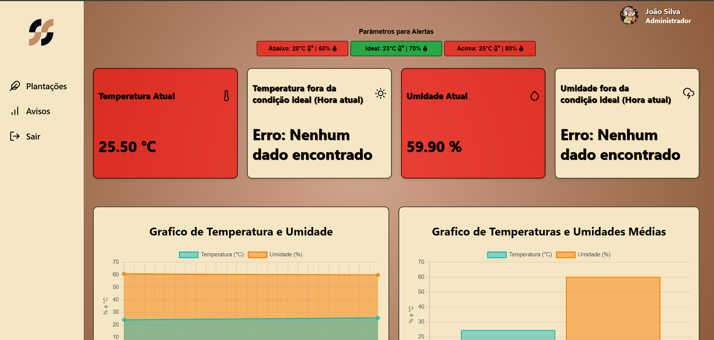
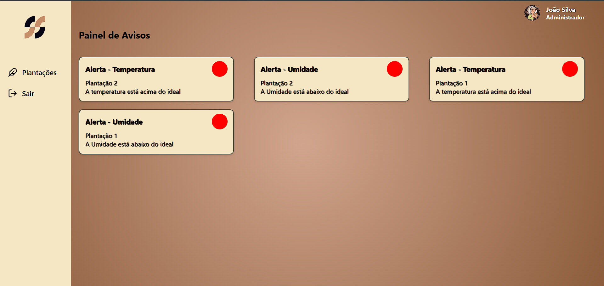

# 🪴 Gestão de Temperatura e Umidade do Solo na Produção de Café Gourmet

Este projeto consiste em um sistema de monitoramento de temperatura e umidade do solo, desenvolvido para otimizar a produção de café gourmet. Com sensores integrados, os agricultores podem acompanhar as condições do cultivo em tempo real. Além disso, criamos uma dashboard intuitiva que facilita a visualização dos dados e auxilia na tomada de decisões, garantindo a qualidade dos grãos e maior eficiência produtiva.

> Imagem da Página Principal 

> Imagem da Página Login

> Imagem da Página Plantações

> Imagem da Página Dashboard

> Imagem da Página Avisos

## 💻 Tecnologias

  
   

## 🤝 Contribuidor

- [Ali Kadri](https://github.com/AliKadri2)
- [Carlos Eduardo](https://github.com/KaduRibeiro1)
- [Felipe Lima](https://github.com/felipe-lim4)
- [Harison Rios](https://github.com/HarisonRios)
- [João Victor](https://github.com/JoaoGaldinoCunha)
- [Rodrigo Olivares](https://github.com/Olivaresss)

## 📝 Licença

Esse projeto está sob licença. Veja o arquivo [LICENÇA](LICENSE.md) para mais detalhes.

---
**Nota:** Este projeto ainda não é responsivo e não oferece suporte para tablets e dispositivos móveis, mas melhorias futuras estão planejadas para garantir uma experiência acessível e otimizada em todas as plataformas.

